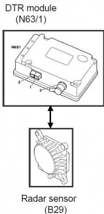
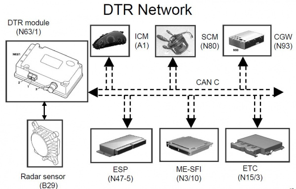
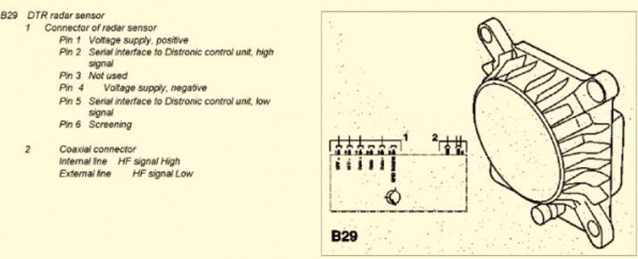
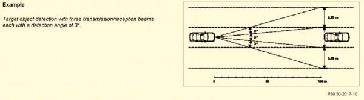
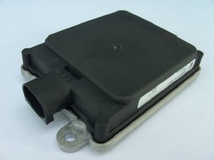
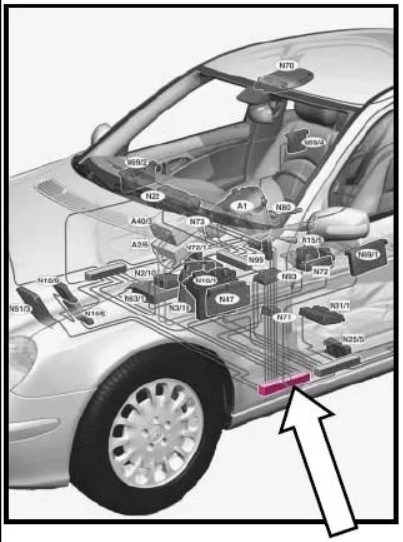

# Reverse Engineering

## Sources

- https://github.com/rnd-ash/mb-w211-pc
- https://github.com/rnd-ash/W203-canbus/tree/master
- https://w220.wiki/Distronic

## W211 ACC

The first version of the *Distronic* is based on a SCU (Sensor and Control Unit).
The Sensor data analysis was also integrated in the ACC control unit.
Later versions and the most comon architecture are seperate units. This makes it very hard to replace the sensor, because we also need to replace the control unit completly.

**Challenge accepted**

The Distronic Controll Unit talks over the CAN_C (Engine CAN) with the ESP.

On the Control unit is also the Speed limiter function implemented. It don't make sense because a limiter and cruise control is available without the Radar & ACC control unit.
*German engineering... :)*

### ACC ECU

Is calld internal as N63/1 (DTR - Distronic)

The Distronic is connected via CAN to the CAN C (Engine Bus) and to the Radar Sensor via Serial and Coaxial cable.

So the DTR gets the Radar RAW data, to the digitalization and Speed control just via CAN and is located under the passenger seat.

Connection via CAN
- CAN C: 
    - 500kb
    - Cable: 
        - Solid Green - CAN_H PIN 
        - Green/white - CAN_LOW
        - CAN C (Engine CAN)
    - Access at the ACC ECU or under entry at the left (driver) side (Green cables) -> for debug and reverse engineering
- Power
    - 12V from Circuit 87
    - GND

Source https://w220.wiki/Distronic

### Radar Sensor

**Old sensor**
- doppler radar at 24Ghz
- Sensor range: 0 - 150m
- measure of speed differences form -50 to 200kph
- Field of view: 3 beams with 3 deg = 9 deg total
    - main corridor 3 deg = a line at 100m
    - adapt this by 3 deg per side
- sends the sensor data over a high frequency coaxial cable to the ACC CU

Source https://w220.wiki/Distronic

**Continental 408-21**
Premium Long Range Radar

- Range up to 260m
- -400 to 200 kph relativ speed measureing
- 3° and 9° FOW. and 45° in short range
- Robust and cost efficent
- EU and USA 
- Connector: Tyco MQS BU-GEH KPL 8P (C-114-18063-128 - Coding A)

Take a look at folder 02_Sensor for more details.

Needes Signals:
- Vehicle moving direction (0 stanstill, 1 forward, 2 reverse) -> Available
- Vehicle Speed in m/s -> available, calc needed
- vehicle Yaw rate (°/s) -> available
  - Sensor Raw value vs mesured deg (Roundabout test)
  - 300 = 180°
  - 600 = 360°
- GIER_ROH / 1.6666 = ° or GIER_ROH * 0.6 = °
  - 0.6 is very close to 57.2958 (180/PI) which is used to transform rad into deg
  - yaw rate is given in rad/s with factor 0.001

- check mounting position to be sure. But should be in rage
- dimensions and cable connector
- check radar Cover.
        - Field of view, 
        - 10mm distance to cover
        - Tilt angle 10° < x < 30°
        - Material (ABS)

## ACC Function

- Works from 30 kph up to 180 kph
    - shut down below 30 kph with (off beep)
    - can be overwrite with acc pedal
- Accelerate (ECU ME-SFI)
    - Speed increase by 1 kph or 10 kph steps
    - decease by 10 kph steps
- breaks automatically (via ESP)
    - limited to 2 m/s (20% of max break power)
    - if more breaking is required -> warn signal
    - breaking is off if the driver push the acceleration pedal (overwrite)
- Gear shift (ETC Electronic Transmission Controll)
- distance can be adjust between 1 to 2 seconds with a lever at the center console
- warning at high speed difference to vehicle ahead (red distance warning lamp)
- low distance warning <0.8 sec over 3 sec (red distance warning lamp)
- constant distance measure and display up to 150m, also if ACC is off
- DTS swith of via
    - cruise control switch push forward
    - break manually
    - speed is below 30 kph

DTR will NOT engage:

- For up to two minutes after engine start-up (This is the initialization or self test phase.)
- Vehicle speed < 25 Km/h or mph
- With Parking Brake activated
- With ESP manually switched OFF
- If gear selector is NOT in position 'D'
- SBC-S/H is active
- ESP, ABS, Brake Gearbox or Engine shows an error
- Crash Signal

### Controll inputs

Cruise Control Switch
 - UP: ON or increase speed by 10 kph steps (max 180 kph)
 - DOWN: decrease speed by 10 kph steps
 - BACK: increase speed by 1 kph steps (max 180 kph)
 - FRONT: off

Distance lever
- select distance between 1 and 2 sec
- Center console

Distance Warning button
- Enable/disable the distance warning
- Center Console

## Interaction with Limiter and CAS

### Limiter

Is activated by pressing the lever stick.
- Disables ACC
- Disables Limiter 

### ACC - Adaptive Cruise Control

Can be activated over 30kph.
Switch off at 20 kph.

### CAS - City Assist - aka - SBC-S (Stop) or (Stau - Trafficjam)

Brakes automatically your car down and hold the brake until you push the pedal again.
Helps on hill start or on traffic jam. In traffic you just need to push the accelration pedal to go on. The car brakes itself if you release the acc pedal.

Can be activated between 0 and 20 kph by lever resume, up, down.
Deactivates over 60 kph.
If you press Resume, Up or Down over 30 kph. The ACC switch on and CAS goes off

Only know on the W211 from 2003 to 2005.
Maybe I can deactivate it on may 2003 W211. The SBC-S system kicks in at low speed and blocks the inputs in this range.

SBS-S (Stop) is not SBC-H (Hold)!

## Vehicle Interface

CAN C (Chassis or engine CAN)
- 500kb
- Connector: driver side under the sill cover
- Green white cables
  - Solid Green CAN_H
  - Green/white CAN_L

# CAN

## inputs

| Input                 | Signal              | Source      | Reason                                                                                 | Alternative                     |
|-----------------------|---------------------|-------------|----------------------------------------------------------------------------------------|---------------------------------|
| **Driver**            |                     |             |                                                                                        |                                 |
| Acc Pedal             | M_FV                | MS_212      | overwrite, acc in passive mode Moment Fahrervorgabe                                    |                                 |
| Brake pedal           | SFB (Fahrer Bremst) | BS_300      | ACC OFF                                                                                | BLS (BremsLichtSchalter) BS_200 |
| Steeringangle         | LWL                 | ACC_LRW 236 | Target selection in corners, acc passive at sharp corners, switch off at fast steerings |                                 |
| Steering speed        | vLWL                | ACC_LRW     | switch OFF at high steering maneuvers                                                  | Ableitung von LWL               |
| **ACC related**       |                     |             |                                                                                        |                                 |
| - **from Stick**      |                     |             |                                                                                        |                                 |
| - set                 | WA                  | ART_MRM_238 | (on, resume, +1 kph)                                                                   |                                 |
| - up                  | S_Plus_B            | ART_MRM_238 | (on, +10 kph)                                                                          |                                 |
| - down                | S_Minus_B           | ART_MRM_238 | (on, -10kph)                                                                           |                                 |
| - off                 | AUS                 | ART_MRM_238 | OFF                                                                                    |                                 |
| - **from Console:**   |                     |             |                                                                                        |                                 |
| - distance adjust     | ART_Abstand         | ESZ_240     | (acc distance calc)                                                                    |                                 |
| - warning on/off      | ART_ABW_BET         | ESZ_240     | send warning or not                                                                    |                                 |
| **vehicle**           |                     |             |                                                                                        |                                 |
| speed                 | V_ANZ kph           | Kombi_412   | (current speed -> acceleration calc, NO acc activation below 30 and over max)          |                                 |
| current engine moment | M_STAT              | MS_312      | startmoment for ACC                                                                    |                                 |
| max speed             | V_MAX_FIX (kph)     | MS_608      | (winterreifen) (Limit acc) optional, can be hardcoded                                  |                                 |
| Fuellevel             | Tank_FS (L)         | Kombi_408   | ACC disable or switch off at low fuel                                                  |                                 |
| Gear is in 'D'        | DRTGTM = 1          | BS_200      | enable                                                                                 | V_ANZ speed over 30kph          |
| ESP is NOT off        | ESP_BET             | ESZ_240     | off or disabled                                                                        |                                 |
| ESP Eperation         | ESP_BET             | ESZ_240     | off                                                                                    |                                 |
| Crash                 | CRASH               | ESZ_240     | off                                                                                    | CRASH_CNF                       |

## output

ART_250
10Hz

ART_258
10Hz

# Controler

## devboards

Waveshare dual CAN hat+ with Power supply 
* https://www.waveshare.com/2-ch-can-hat-plus.htm 
* 36€

## Industry Supplyer

* TTControl
https://www.ttcontrol.com/products/electronic-control-units/ecu-overview
a

* MRS Electronic
https://www.mrs-electronic.com/produkte/vernetzte-steuerungen

* Bosch Rexroth BODAS
https://store.boschrexroth.com/Mobilelektronik-und-Telematik/BODAS-Hardware/BODAS-Steuerger%C3%A4te

Focus on:

- TTC 32 https://www.ttcontrol.com/sites/default/files/documents/TTControl-HY-TTC-32-Datasheet.pdf 
- MRS M2600 https://www.mrs-electronic.com/produkte/detail/m2600-eco-can-sps
- BODAS RC4-5/30
- BODAS RC5-6/40

## ECU Comparision

| Device          | CANs | Power | Housing  | Cost  | Addon needs                 |
|-----------------|------|-------|----------|-------|-----------------------------|
| MRS M2600       | 2-3  | 9-32V | Alu IP65 | <500€ | -                           |
| TTC 32x         | 2    | 8-32V | Alu IP67 | 1000€ | Dev Environment (extra cost) | 
| BODAS RC5-6/40  | 3    | 8-32V | Alu IP6x | ?     | -                           | 
| BODAS RC-4-5/30 | 2    | 8-32V | Alu IP6x | ?     | -                           | 

# Software

## os
FreeRTOS 
* https://freertos.org/ ?
* Realtime OS - support for multitasking

## State machine

### INIT
* startup
Not Ready (Disabled)
* Ready Checker (No -> Not Ready)
Ready_standby
* Ready Checker (No -> NotReady, Yes -> go on)
* warning calc
* Enable condition (No -> Rady, Yes -> Active)
Activ
* Ready Checker (No -> NotReady, Yes -> go on)
* warning calc
* Disable condition (No -> Active, Yes -> Ready)

### Ready_checker
* timeout check: collect all needed CAN messages to fill info storage
    * BS_200
    * ...
* Check Vehicle and Sensor signals
    * no Errors (Vehicle, Radar)
    * other ready conditions (Vehicle, Radar)
    * speed to high >180

### Enable Condition
* Ready Check position
* Speed over 30 kph
* No Reverse
* Set Speed (Up, Down, resume)

### Disable Condition
* cruise control switch push forward
* break manually
* speed is below 30 kph
* Ready Check negative
* to hard breaking
* to fast steering
* to big Steering angle

### Override / Passive
You can overwrite the Distronic / ACC everytime by pressing the accelerator pedal.
The ACC goes into a passive mode and will resume if you release the pedal.

#### Enable Override (Distronic Passiv)
* M_FEV > M_ART # Driver Moment request is bigger than the Distronic moment request

#### Disable Override (Distronic Passive)
* Speed V < V_ART
* Pedal < 5%

Warning calc
* if warnings are active
* distance to low warning <0.8 sec over 3 sec (red distance waring lamp)
* high speed differences to target

- test brake conditions and edge cases
- test sensor reliability
- test CAN message parsing

## Reverse Engineering

It takes a while to create the CAN DBC.
Especially to find all needed factors and offset (value = can_raw_value * factor + offset).
Most values have a factor of 0,5 or 0,1.

* T_MOT    = can_raw_value * 0.5 - 20
* T_AUSSEN = can_raw_value * 0.5 - 40
* VB       = can_raw_value * 0.01
* vLRW     = can_raw_value * 0.5 - 2048
* GIER_ROH = unit, factor and offset needed.
  * try with deg/s. Offset = 128 and factor close to 0.6
  * I drove some roundabout to get 180° and 360°.
    * need to integrate GIER_ROH over time to see the if it  fits.
  * factor of 0.6 
  * later I figured out factor 0.6 is about **180/PI = 57,2955** and is used to convert RED to DEG -> UNIT is RAD now. Offset and factor found fast
  * UNIT: RAD (makes more sense now)
* AY_S (lateral acceleration)
  * only 8bit. offset at 123 -> ist unsigned  = -123 to 123.
    * Got the hint positive values are left...
  * Factor?
  * Unit? m/s² or g
  * I can calc AY from speed and radius.

**And the ACC ECU controls the LIMITER to -> more work...**
But more or less the same functions.

# PID Controller

I want to use a PID Controller for the cruise control.

To do some simulation for a first calibration,
and to have some setpoint during touring down without throttle, a torque speed map is needed

| Speed [kph] | Torque [Nm] |
|-------------|-------------| 
| 30          | 206,7       |
| 50          | 213,5       |
| 60          | 217,9       |
| 100         | 241,5       |

