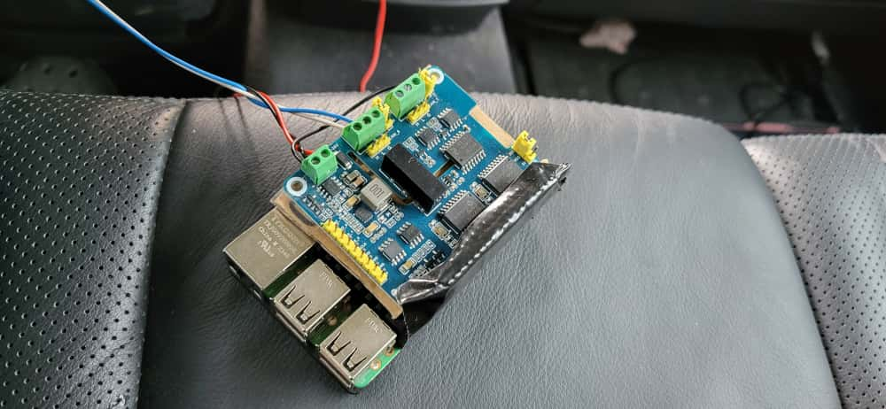
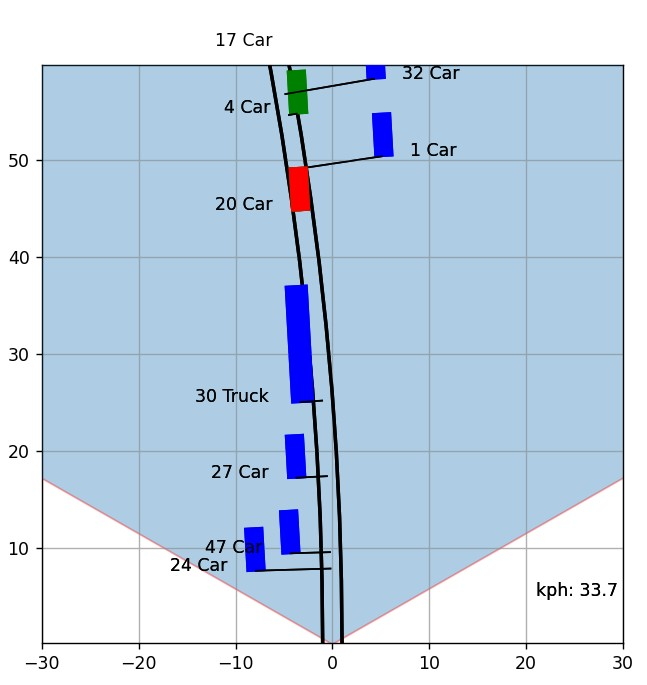
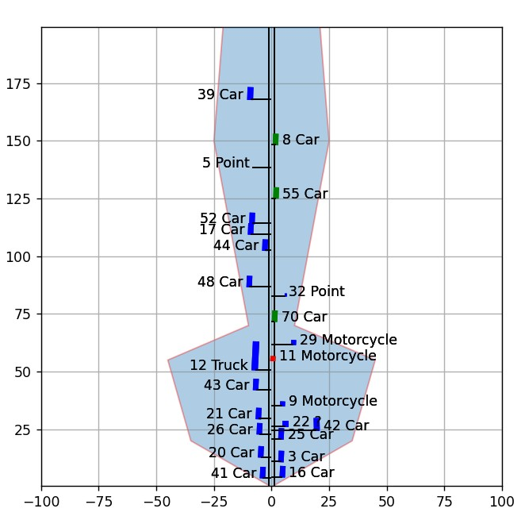

# Tooling

## CAN interface

To access the CAN Bus of the car is a CAN interface needed.

I choose a Vector VN1610.

Because:
- USB interface
- it comes with two CAN line at one SUBD9 connector
- Good software support (cloud use it with Vector software - but Freeware works also)
- and I had one flying around in my garage
- dont forget to install the driver (XL-Driver Lib)

It only works with CAN Database in the free .dbf format. 
But is also include a hidden converter to create .dbf from .dbc
Tools -> Format Converter -> Other Converters -> DBC to DBF Conversion

## CAN software

**BUSMASTER** is an excelent CAN BUS software. 
- quick to learn
- It helps a lot to read out the CAN and correct the CAN Database
- **CAN logging**
- CAN debugging, parsing and visualisation
- **CAN replay**

Also ASAMMDF (Python) comes with a good GUI and a loot of tools.

When you install a Vector software. A very usefull comes with it.
**CANdb++** a very intuitive tools to create and mantain CAN Database

## CAN onboard logger

I install in the car a CAN logger to collect daily raw data from normal system behavior.
If I replace the ART-ECU and sensor, I can not original system data anymore easy.
Data could be useful to for analysis later.  

Material:
- Pi 3 (is still cheap)
- 2 channel hat
  - Waveshare dual CAN hat+ with Power supply 
  - can1 Vehicle CAN_C (engine & ART/ACC)
  - can2 Radar
  - power comes from the lighter socket nearby
    - I bridge ground from power to CAN GND
- optional extension for later
  - Waveshare dual CAN hat
    - can3 Vehicle CAN_B (comfort)
    - can4 spare

Software:
- can_logger -> records raw CAN data in Busmaster log file format to view & replay later
- Syncthing -> to upload the data automatically it a connection (Hotspot) is available

## Radar viewer

A software to display the radar data for better understanding and testing. 
radar_viewer

simple display with matplotib
- read and parse radar can data
- display radar objects with ID and type on a map
- show driving path (with curve)
- test target selector 
  - calc distance to path -> is obj in path
  - calc closest obj in path

 
details view at close objects

 
long distance view