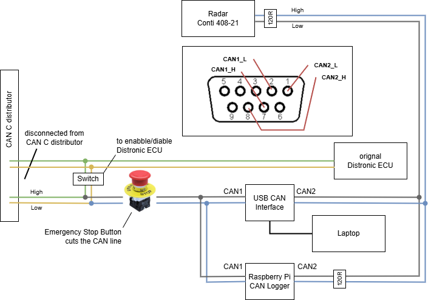
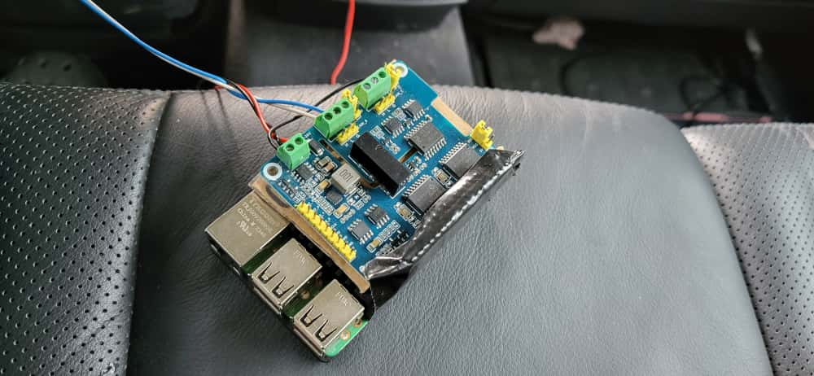
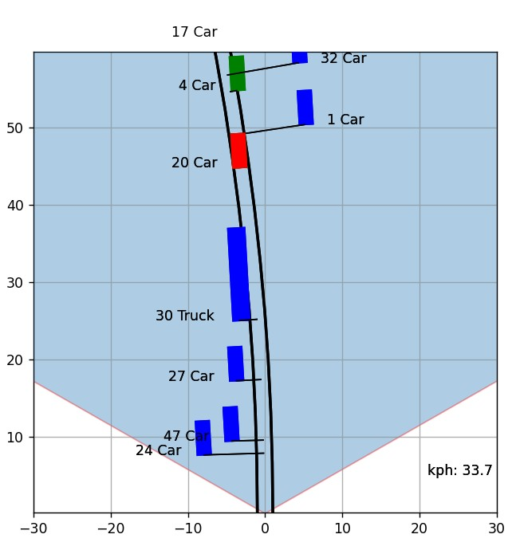
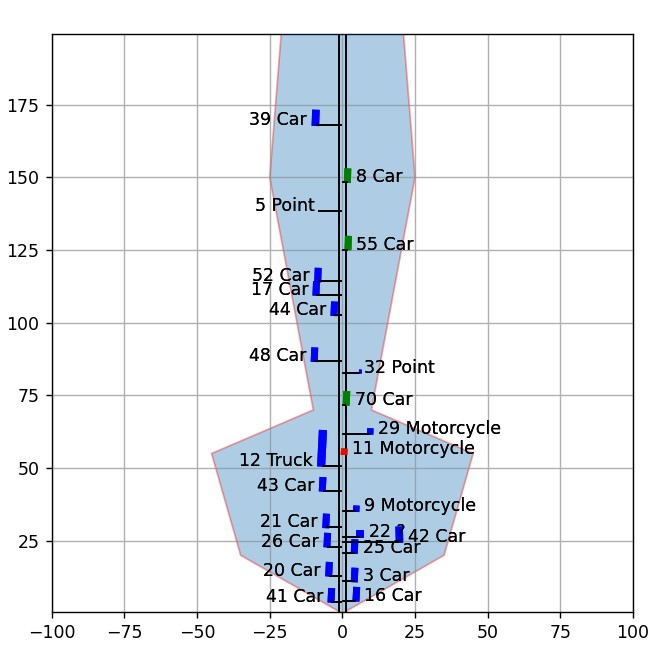

# Tooling

## CAN interface

To access the CAN Bus of the car, a CAN interface is needed.

I chose a Vector VN1610. I support two CAN lines in a compact housing.

Because:
- USB interface
- it comes with two CAN lines at one SUBD9 connector
- Good software support (could use it with Vector software - but Freeware works also)
- and I had one flying around in my garage
- don't forget to install the driver (XL-Driver Lib)

It only works with CAN Database in the free .dbf format. 
But it also includes a hidden converter to create .dbf from .dbc
Tools -> Format Converter -> Other Converters -> DBC to DBF Conversion

## Wiring

## CAN Software

**BUSMASTER** is an excellent CAN BUS software. 
- quick to learn
- It helps a lot to read out the CAN and correct the CAN Database
- **CAN logging**
- CAN debugging, parsing and visualisation
- **CAN replay**

Also ASAMMDF (Python) comes with a good GUI and a lot of tools.

When you install a Vector software, a very useful tool comes with it.
**CANdb++** a very intuitive tool to create and maintain CAN Database

### SIL (Software In The Loop)

I use Busmaster to replay CAN logs to test my software. 
Here I can check and compare the software quickly to the original vehicle behavior.
Just the controller doesn't have real feedback. The I (Integrator) will not work here and screw up with the time. But that's perfect to test also this situation and safety measures (anti wind up strategies). 

## CAN onboard logger

I installed in the car a CAN logger to collect daily raw data from normal system behavior.
If I replace the ART-ECU and sensor, I cannot get original system data anymore easily.
Data could be useful for analysis later.  

### Material:
- Pi 3 (is still cheap)
- 2 channel hat
  - Waveshare dual CAN hat+ with Power supply 
  - can1 Vehicle CAN_C (engine & ART/ACC)
  - can2 Radar
  - power comes from the lighter socket nearby
    - I bridge ground from power to CAN GND
- optional extension for later
  - Waveshare dual CAN hat
    - can3 Vehicle CAN_B (comfort)
    - can4 spare

### Software:
- can_logger -> records raw CAN data in Busmaster log file format to view & replay later
- Syncthing -> to upload the data automatically if a connection (Hotspot) is available

### Pinout

CAN pinning on a DSUB 9 connector

- CAN0
  - Pin 2 - can low
  - Pin 7 - can high
- CAN1
  - Pin 1 - can low
  - Pin 8 - can high
- Power
  - Pin 3 - GND
  - Pin 9 - Vcc+

## Radar viewer

A software to display the radar data for better understanding and testing. 
radar_viewer

simple display with matplotib
- read and parse radar can data
- display radar objects with ID and type on a map
- show driving path (with curve)
- test target selector 
  - calc distance to path -> is obj in path
  - calc closest obj in path

 
details view at close objects

 
long distance view