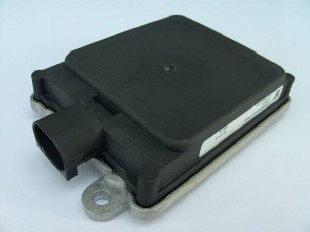

# Radar Sensor

## W211

Technical facs of the W211 Radar

source: https://w220.wiki/Distronic#Distronic
 
 

- Sensing up 150m
- 3° main coin sensing
- 9° in Total

## Conti 408-21

Premium Long Range Radar at 77Ghz

- Range from 170 up 250m
- -400 to 200kph relativ speed detection
- CAN Bus interface at 500kb
- can used in 
    - European Union
    - USA
    - Canada
    - Russia
    - South Korea
    - Australia
    - Japan and further countries
- made for instustrie and automitive applications
- Sensor works from 9-32V DC

*distance on X axsis x10

This sensor outperform the old one.
And is easy to integrate. Just 4 Wires are needed to bring the sensor to live.
- Power + direct from battery
- GND
- CAN-H
- CAN-L

