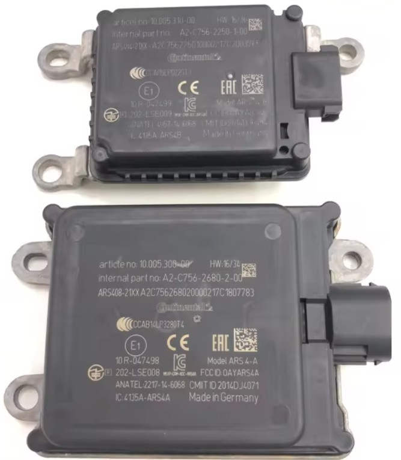
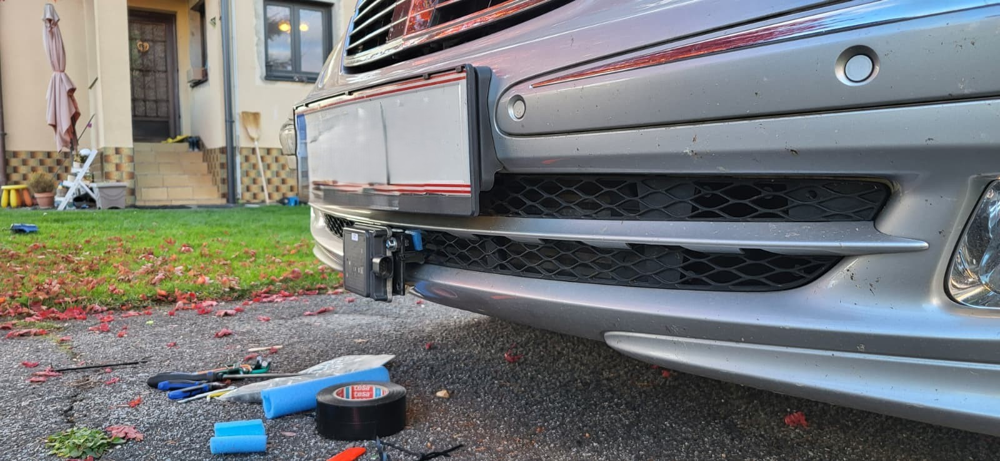
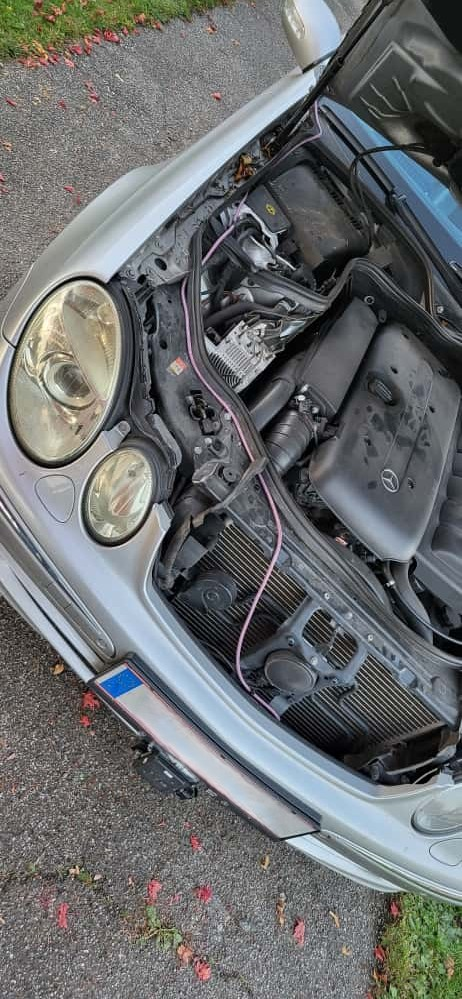

# Radar Sensor

Here we take a look at the radar sensor.  
We will examine the performance of the old sensor.  

The new sensor should deliver the same or better performance.

## W211

Technical facs of the W211 Radar

source: https://w220.wiki/Distronic#Distronic
 
 

- Sensing up 150m
- 3° main coin sensing
- 9° in Total

## Conti ARS 408-21

Premium Long Range Radar at 77Ghz

**I chose the Conti 408-21 because:**
- it is better than the old radar sensor
- it has a CAN interface
- the cost is acceptable
- same size and could be placed at the original sensor position with small adaptations
- and most importantly, it is available for purchase

>**Addendum:** 
The ACC investigations recommend a maximum sensor range of 120 m,  
due to excessive false detections at greater distances without reliable lane detection.
With this information, the Conti radar **ARS 404-21 Entry**, with a maximum scan range of 170 m, could also be suitable.

 
Picture of a Conti ARS 404-21 and 408-21 radar

**ARS 408-21 Technical data**
- Range from 170 up 250m
- -400 to 200kph relative speed detection
- CAN Bus interface at 500kb
- can be used in 
    - European Union
    - USA
    - Canada
    - Russia
    - South Korea
    - Australia
    - Japan and further countries
- made for industry and automotive applications
- Sensor works from 9-32V DC

 
*distance on x axis factor 10

This sensor outperform the old one.
And is easy to integrate. Just 4 Wires are needed to bring the sensor to live.
- Power + direct from battery
- GND
- CAN-H
- CAN-L

## 24 GHz vs. 77 GHz

The old sensor works in the 24 GHz band. This is ideal for distances in close range 0,5m up to 100m. 
That's why a lot of side and corner radar system working now in the 24 Ghz band.
This radar don't work well below 1m. That's why they don't have replaced the ultrasonic close range park sensors.

With the long distance sensor it's needed to move to the 77-81 GHz spectrum.

# Integration

## CAN

The 408-21 needs the following CAN MSG IDs:

MsgId = MsgId + SensorId * 10
0x200 with SensorId 0 = 0x200
0x200 with SensorId 1 = 0x210

* 0x008 - Relay control 
* 0x20x - Config & status
* 0x30x - Speed & Yaw input
* 0x40x - Collision detection config and status
* 0x60x - Cluster & obj data
* 0x700 - Version ID

-> for details look at datasheet or DBC

-> CAN Ids overlaps with the Engine CAN - separate CAN lines!

### Input

* 0x300 Speed in m/s
* 0x301 Yaw rate in deg/s

*config excluded

### Output

### Config

set radar config

0x200 Radar config

| Siganl          | Config            |
|-----------------|-------------------|
| MaxDistance [m] | 250               |
| SensorID        | 0                 |
| OutputType      | 1 (send objects)  |
| RadarPower      | 0 (standard)      |
| CtrlRelay       | 0 (inactive) 1?   | 
| SendQuality     | 0 (inactive) 1?   |
| SendExtInfo     | 0 (inactive)   1? | 
| SortIndex       | 1 (by range)      |
| StoreInNVM      | 1 (active)        |
 | RCS_Threshold   | 0 (standard)      | 

0x202 Filter config

 | Signal                    | Config   | 
|---------------------------|----------|
 | FilterCfg_Valid           | 1        |
 | FilterCfg_Active          | 1        |
 | FilterCfg_Index           | 0        |
 | FilterCfg_Type            | 1        | 
 | filtercfg_min_nofobj      | 0        |
 | filtercfg_max_nofobj      | 20 ?     |
 | filtercfg_min_distance    | 0.0      |
 | filtercfg_max_distance    | 409.0 ?  |
 | filtercfg_min_azimuth     | -50.0    |
 | filtercfg_max_azimuth     | 50.0     |
 | filtercfg_min_vreloncome  | 0.0      |
 | filtercfg_max_vreloncome  | 128.0    |
 | filtercfg_min_vreldepart  | 0.0      |
 | filtercfg_max_vreldepart  | 128.0    |
 | filtercfg_min_rcs         | -20.0    |
 | filtercfg_max_rcs         | 30.0     |
 | filtercfg_min_lifetime    | 0.0      |
 | filtercfg_max_lifetime    | 409.0 ?  |
 | filtercfg_min_size        | 0.0      |
 | filtercfg_max_size        | 102.0    |
 | filtercfg_min_probexists  | 5 (99%)  |
 | filtercfg_max_probexists  | 7 (100%) |
 | filtercfg_min_y           | -409.0   |
 | filtercfg_max_y           | 409.0    |
 | filtercfg_min_x           | 0.0      |
 | filtercfg_max_x           | 0.0      |
 | filtercfg_min_vyrightleft | 0.0      |
 | filtercfg_max_vyrightleft | 128.0    |
 | filtercfg_min_vxoncome    | 0.0      |
 | filtercfg_max_vxoncome    | 128.0    |
 | filtercfg_min_vyleftright | 0.0      |
 | filtercfg_max_vyleftright | 128.0    |
 | filtercfg_min_vxdepart    | 0.0      |
 | filtercfg_max_vxdepart    | 128.0    |

## Radar inegration

### Test setup for testing and data collection

First quick installation of the radar on the car to collect CAN data.

Power supply comes from a lighter socket. :) 

 
Side view

 
Front view

 
temporary wiring
 
Now it's time for a coffe and do some data collection runs in the night when its hard to see the external radar sensor.
I don't need trouble with race control. ;) 

### Speed and Yaw relay

The radar needs a speed and yaw input. This will do the "can_relay" script.
It reads speed and yaw from the vehicle CAN. Do some calc km/h->m/s and send it to the radar CAN.

