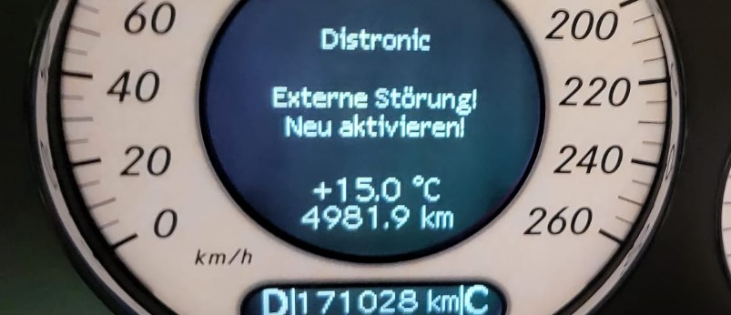

# W211 ACC

This project is about to replace the ACC radar a MB W211.

## Motivation

The radar runs on 24GHz and is disrupted by other radar modern radar systems.
The most new car use radar at 24GHz for BlindSpotWarning (BSW).
This systems interfere with the W211 radar and the ACC throws an error and stop working.

The modern radar uses a frequency sweep. So it changes the frequency permanent to be robust.

## Limitations

This is just a Proof of Concept!

Don't use this on the public road!

I set this project up in seval steps

## Reverse engineering

This is about to learn how the ACC in the Car works.

Write down the basic functions and technical details how the ACC in the Car works.

The ACC talks with the vehicle about a single CAN line (CAN_C - Engine CAN).
With a CAN Database I can read out all needed information from the vehicle and what is send by the ACC control unit.

Is it possible to replace the ACC with a new controller and sensor?
I think so -> lets try with a Proof of Concept (a simple cruise control at first)

Many thanks to the website:
https://w220.wiki/Distronic#Distronic

And:
https://github.com/rnd-ash/mb-w211-pc

This was a Jumpstart!

## Tooling

Notes about the Tooling in need to do this.

* USB CAN Interface -> Vector VN1610. Bus other would also work
* CAN Logging and interpreting SW -> Busmaster

## Radar Sensor

What radar sensor can replace the original W211 rada.

The **Continental 408-21** looks good. 
- more range than 
- very robust
- easy interface over CAN
- little bit older but not so expensiv
- wide short range

## PoC

In Progress