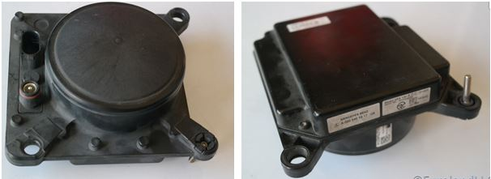
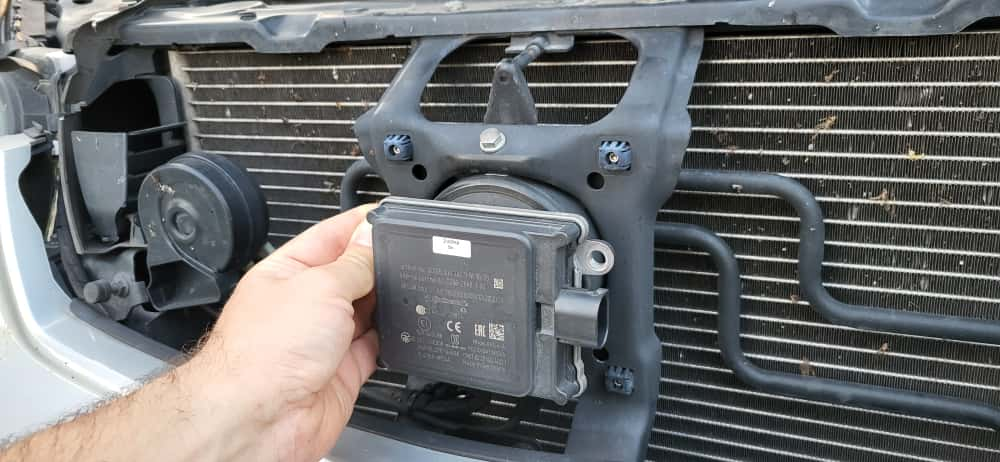
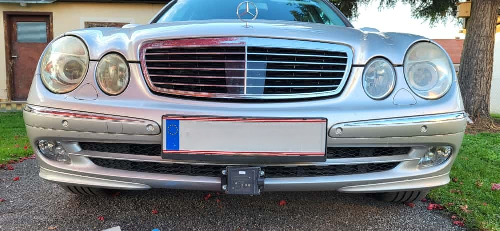

# W211 Adaptive Cruise Control (ACC) Replacement

This project aims to replace the Adaptive Cruise Control (ACC) system on the Mercedes-Benz W211.  
The system is also known as ART (German for "AbstandsRegelTempomat") or Distronic.

---

## Motivation

The original W211 radar operates at 24 GHz and is often disrupted by modern radar systems.  
Most new vehicles use 24 GHz radar for Blind Spot Warning (BSW).  
These systems interfere with the W211 radar, causing the ACC to throw an error and stop working.  
In traffic, the ACC/CC cannot be used or reactivated for a while, making it impractical.

 
Distronic error message 4 - External interference

Modern radar systems use frequency sweeps, continuously changing frequency to improve robustness.

## Limitations

⚠️ **This is only a Proof of Concept!**  
- Do not use on public roads.  
- Do not attempt at home.  
- Project is under active development.  

---

## Project Steps

### Reverse Engineering

Goal: Understand how the ACC in the W211 works.

**Challenge:** The radar does not have its own compute unit.  
It is integrated into the ACC control unit (SCU – Sensor and Control Unit).  
Therefore, both the sensor and the control unit must be replaced.

 
Original Distronic sensor

The ACC communicates with the vehicle via a single CAN line (CAN_C – Engine CAN).  
Using a CAN database, all relevant signals can be decoded.  
Is it possible to replace the ACC with a new controller and sensor?
I think so -> lets try with a Proof of Concept (a simple cruise control at first)

Many thanks to the websites:
- https://w220.wiki/Distronic#Distronic
- https://github.com/rnd-ash/mb-w211-pc

This was a Jump start!

Details are here: **[Reverse engineering](00_Reverseengineering/readme.md)**

---

## Requirements

See **[Requirements](requirements.md)**.  
This section contains the 
- **requirments**
- **systems engineering**
- extracts from **ISO 15622** and **ISO 22179**
- mathematical stuff
- a short history outlook
- and documentation 

for the project.

---

## Safety ⚠

Refer to the **[Safety Analysis](Safety.md)**.  
This section provides an overview of the **HARA** (Hazard Analysis and Risk Assessment) in accordance with **ISO 26262**.

---

## Tooling

- USB CAN interface → Vector VN1610 (others may work)  
- CAN logging and interpretation software → Busmaster  
- Small ECU with CAN interface for PoC  
  - Raspberry Pi with CAN hat 

Pi with CAN hat for CAN logging and PoC testing
 

---

## Radar Sensor

Candidate replacement for the original W211 radar: **Continental 408-21**  
- Greater range  
- Robust performance  
- Simple CAN interface  
- Affordable (older generation)  
- Wide short-range coverage  

Fits good at the original sensor position.

---

## Development Progress

### Proof of Concept
- [x] CAN reverse engineering  
  - [x] Collect raw data for evaluation  
- [x] Requirements and engineering – mostly completed  
- [x] Simple cruise control to prove the concept – working  
- [x] Radar sensor selection  
- [x] Temporary radar integration  
  - [x] Target selector – up and running  

### Pilot / Minimum Viable Product
- [x] PoC review and refactor - in progress
- [ ] Driver inputs and state machine  
- [ ] Radar and tracking module  
- [ ] Controller modules  
  - [ ] Distance control (`a_dist`)  
  - [ ] Speed control (`a_speed`)  
  - [ ] Warning module  
  - [ ] Dynamic limiter (curve adaptation, `a_max`)  
- [ ] Coordinator module `min(a_dist, a_speed, a_max)`  
- [ ] Longitudinal control (vehicle model, `a → M`)  
- [ ] Permanent hardware integration  

---

## Pictures

# Pictures

 
Temporary radar integration to collect radar data.

 
A live radar object viewer with object filter, target selector and driving path estimation

 
State machine

 
Function model

 
Distance controller model

---

## Credits

- Documentation of ART/Distronic system: 
  - https://w220.wiki/Distronic  
- CAN bus data:  
  - https://github.com/rnd-ash/mb-w211-pc  
  - https://github.com/rnd-ash/W203-canbus/tree/master  

---

## License

Currently no license set → all rights reserved.  
Project is under development.  
Includes third-party libraries.