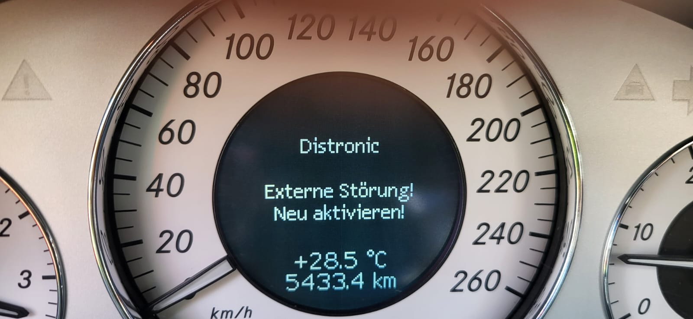
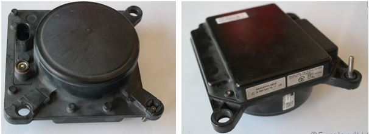
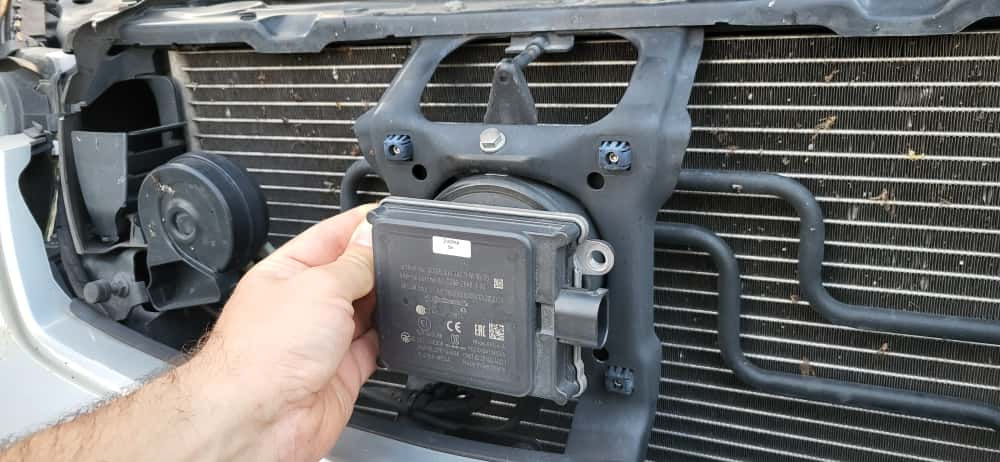
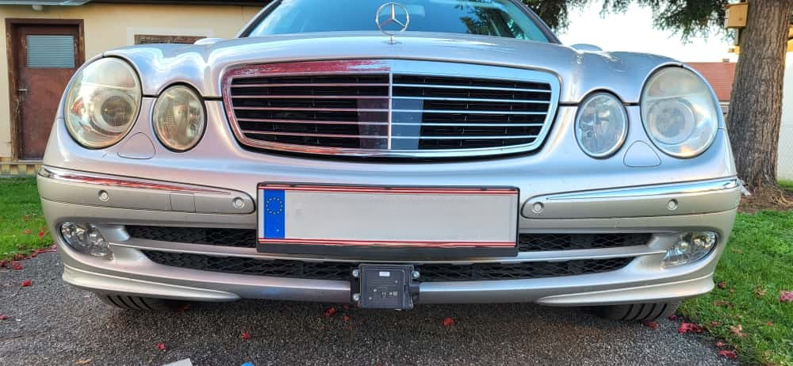
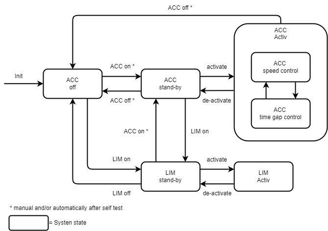
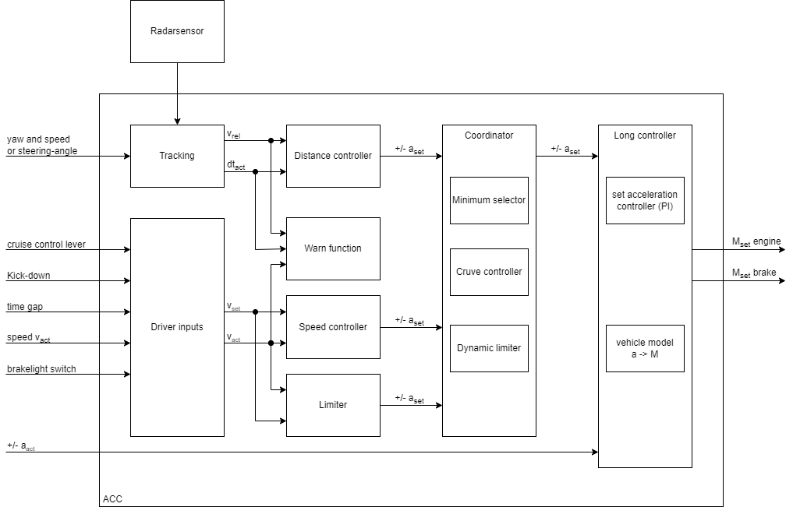
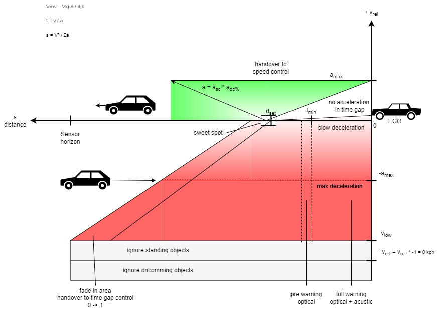

# W211 Adaptive Cruise Control (ACC) Replacement

This project aims to replace the Adaptive Cruise Control (ACC) system on the Mercedes-Benz W211.  
The system is also known as ART (German for "AbstandsRegelTempomat") or Distronic.

This Distronic (DTR) function with Radaer Sensor (B29) is available from 1998 to 2008 for the Models:
* S W215, C215, **W220**
* E E240, **W211**
* SL R230
* CLK **W209**
* CLS W219, C119 
* and later for the ML **W163**

Check: https://w220.wiki/Distronic

Videos:
* 1998 DTS explanation: https://www.youtube.com/watch?v=OvIG9nqlcUI
* DISTRONIC overview: https://www.youtube.com/watch?v=20x9FopDHFM

---

## Motivation

The original W211 radar operates at 24 GHz and is often disrupted by modern radar systems.  
Most new vehicles use 24 GHz radar for Blind Spot Warning (BSW).  
These systems interfere with the W211 radar, causing the ACC to throw an error and stop working.  
In traffic, the ACC/CC cannot be used or reactivated for a while, making it impractical.

 
Distronic error message - External interference

Modern radar systems use frequency sweeps, continuously changing frequency to improve robustness.

## Limitations

⚠️ **This is only a Proof of Concept!** ⚠️
- Do not use on public roads.  
- Do not attempt at home.  
- Project is under active development.  

---

## Development Progress

### Proof of Concept
- ✅ CAN reverse engineering  
  - ✅ Collect raw data for evaluation  
- ✅ Requirements and engineering – mostly completed  
- ✅ Simple cruise control to prove the concept – working  
- ✅ Radar sensor selection  
- ✅ Temporary radar integration  
  - ✅ Target selector – up and running  

🏆 PoC is working and the engineering is done - let's bring everything together.

### Pilot / Minimum Viable Product
- ✅ PoC review and refactor
- [ ] Driver inputs and state machine - 🚧 under construction 🚧
- [ ] Simple Speed controller
- [ ] Radar and tracking module  
- [ ] Controller modules  
  - [ ] Distance control (`a_dist`)  
  - [ ] Speed control (`a_speed`)  
  - [ ] Warning module  
  - [ ] Dynamic limiter (curve adaptation, `a_max`)  
- [ ] Coordinator module `min(a_dist, a_speed, a_max)`  
- [ ] Longitudinal control (vehicle model, `a → M`)  
- [ ] Permanent hardware integration  

---

## Project Steps

### Reverse Engineering 🔍

Details are here: **[Reverse engineering](00_Reverseengineering/readme.md)**

Goal: Understand how the ACC in the W211 works.

**Challenge:** The radar does not have its own compute unit.  
It is integrated into the ACC control unit (SCU – Sensor and Control Unit).  
Therefore, both the sensor and the control unit must be replaced.

 
Original Distronic sensor

The ACC communicates with the vehicle via a single CAN line (CAN_C – Engine CAN).  
Using a CAN database, all relevant signals can be decoded.  
Is it possible to replace the ACC with a new controller and sensor?
I think so -> let's try with a Proof of Concept (a simple cruise control at first).

Many thanks to the websites:
- https://w220.wiki/Distronic#Distronic
- https://github.com/rnd-ash/mb-w211-pc

This was a jump start!

---

### Requirements

See **[Requirements](requirements.md)**.  
This section contains the 
- **requirements**
- **systems engineering**
- extracts from **ISO 15622** and **ISO 22179**
- mathematical stuff
- a short historical outlook
- and documentation 

for the project.

---

### Safety ⚠

Refer to the **[Safety Analysis](Safety.md)**.  
This section provides an overview of the **HARA** (Hazard Analysis and Risk Assessment) in accordance with **ISO 26262**.

---

### Tooling 🔧

Details here: **[Tooling](01_Tooling/readme.md)**. 

- USB CAN interface → Vector VN1610 (others may work)  
- CAN logging and interpretation software → Busmaster  
- Small ECU with CAN interface for PoC  
  - Raspberry Pi with CAN hat 

Pi with CAN hat for CAN logging and PoC testing
 

---

### Radar Sensor

Details here: **[Sensor](02_Sensor/readme.md)**. 

Candidate replacement for the original W211 radar: **Continental ARS 408-21**  
- Greater range  
- Robust performance  
- Simple CAN interface  
- Affordable (older generation)  
- Wide short-range coverage  

Fits well at the original sensor position.

---

# Pictures

 
Temporary radar integration to collect radar data.

 
A live radar object viewer with object filter, target selector, and driving path estimation.

 
State machine

 
Function model

 
Distance controller model

---
## AI Note

NO VIBECODE

AI use is limited. 100% organic code. So please excuse my many typos.

## Credits

- Documentation of ART/Distronic system: 
  - https://w220.wiki/Distronic  
- CAN bus data:  
  - https://github.com/rnd-ash/mb-w211-pc  
  - https://github.com/rnd-ash/W203-canbus/tree/master  

## License

Currently no license set → all rights reserved.  
Project is under development.  
Includes third-party libraries.