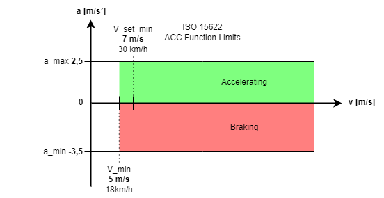
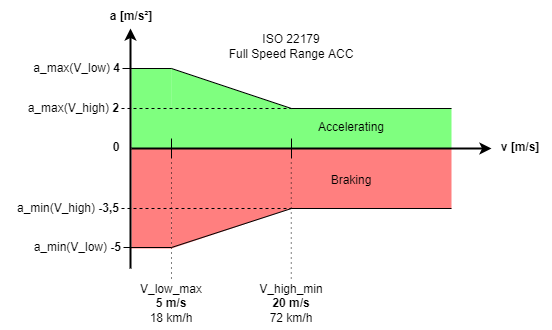
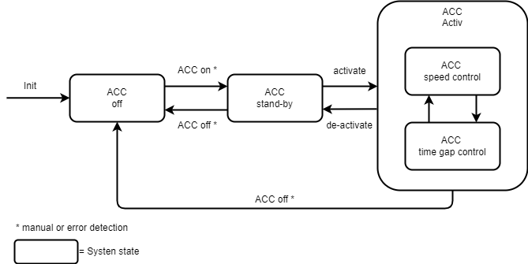
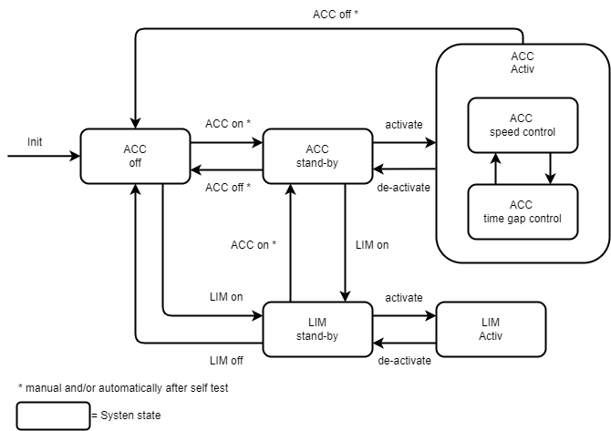
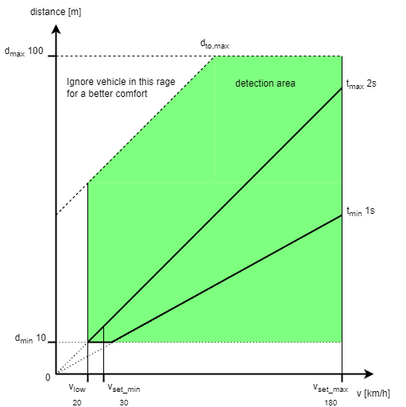

# ACC

An Adaptive Cruise Control (ACC) is a vehicle speed controller how adjust to the traffic situation. 

International Standard:
- ISO 15622 (Transport information and control System - Adaptive Cruise Control Systems)
  - First standard with basic function description
  - Use of braking is open -> but currently very common
- ISO 22179 (Intelligent transport systems - Full speed ragen adaptive cruise control (FSRA))
  - expansion to low speeds

The main function of the ACC is the speed control to a set target speed.
And the most important feature is the adaption of the vehicle speed to speed of next vehicle in front.
The ACC have to keep a minimum distance to vehicle in front based related (*Time gap*) to the current speed.
If the target vehicle leaves the driving corridor, the vehicle will resume to the set target speed.

**Time gap** to front vehicle:

t = d/v

* t - Time gap
* d - clearance distance
* v - vehicle speed


**History of the ACC development**

The function was firstly documented in 1981.
The introdution of EURO III requires a installation of electronik throttle.
This was very usefull for the common cruise control function.
A benefit was also the integration os the ESP system how allows active braking and access to a yaw sensor for curve path estimation. 

The first cars was available around 2000 on the market.
And from 2005 also with low speed support and "Stop & Go" function.

## Requirements

From ISO 15622

Free Driving
- Keep speed constant and ensure high comfort
  - Low jerks and no oscillations
- Use the brake to reduce speed if the target speed was set lower or when driving downhill

Following Mode
- Regulate speed by adopting the speed of the vehicle ahead, with damping to avoid copying its speed fluctuations
- Maintain the set time gap to the target time gap
- Smooth fallback during cut-in events
- Ensure stability during convoy driving with other ACC vehicles
- Provide sufficient acceleration for smooth merging and catching up
- Provide adequate deceleration for following in flowing traffic
- Automatically detect target objects when approaching or during lane changes of vehicles ahead within a defined distance range using a specified target search corridor

During Approach
- Quickly adjust to the target distance during slow approach
- During fast approach, provide a predictable deceleration profile to help the driver assess whether manual intervention is needed due to insufficient ACC deceleration
- When "diving" into the safety distance, the vehicle should fall back appropriately

Functional Limits
- No control at very low speeds and handover to the driver (ISO 15622: ≤ 5 m/s (18 kph), no positive acceleration)
- Minimum target speed above 7m/s (30kph)
- The time gap must not fall below 1s in steady-state conditions 
- Driver intervention has priority
- Deactivation upon brake pedal actuation
- Override upon accelerator pedal actuation
- Driver sets the target speed (v_set) and target time gap (t_set)
- Proper handover in case of system failure, especially during a deceleration process
- Acceleration must remain within the limits of a_min = -3.5 m/s² to a_max = 2.5 m/s²



**Additional Requirements for Full Speed Range ACC (ISO 22179)**

During Following
- Control down to a speed of 0 km/h (complete stop), especially during low-speed driving

During Stopping
- Maintain a stopping distance of 2–5 m
- Apply higher deceleration at low speeds
- Ensure safe standstill using an appropriate braking system
- In case of system shutdown without driver intervention while stationary, a transition to a safe holding state is required

Functional Limits
- over V_high_min = 20 m/s (72 kph)
  - a_max(V_high) = 2 m/s²
  - a_min(V_high) = -3,5 m/s²
  - y_max(V_high) = 2,5 m/s³
- below V_low_max = 5 m/s (18 kph)
  - a_max(V_low) = 4 m/s²
  - a_min(V_low) = -5 m/s²
  - y_max(V_low) = 5 m/s³



## System structure

Functional Modules of ACC
- ACC State Management
- Control Elements
- Display Elements
- Self-Diagnosis
- Environmental Sensing
- Target Object Selection
- Path Determination
- Vehicle Dynamics Sensing
- Following Control
- Special Situation Handling
- Speed Control
- Acceleration Control
- Braking Control
- Powertrain Control


## State machine

<br>
ACC onlye state machine
<br>
<br>
<br>
Add Limiter

## Input

# Ready_checker
* timeout check: collect all NEEDED CAN messages to fill info storage
    * '0x200',    # BS (Break System) - drive direction, ESP
    * '0x300',    # BS - enable ART
    * '0x236',    # ART_LRW - Steering
    * '0x238',    # ART_MRM - Buttons
    * '0x240',    # EZS - Buttons
    * '0x212',    # MS - Enable ART
    * '0x308',    # MS - Data
    * '0x312',    # MS - Moments
    * '0x412',    # Kombi - speed
* No NEEDED CAN msg is older than 500ms
* Check Vehicle and Sensor signals
  * **CANCEL/DISABLE** Conditions
    * Errors (Vehicle, Radar)
      * ESP_KL = 1 (ESP Light ON)
      * ESP_INFO_DL = 1 (ESP Info Light ON)
      * ESP_INFO_BL = 1 (ESP Info Light Blinking is ON)
      * ABS_KL = 1 (ABS)
      * BRE_KL = 1 (Break)
      * NOTL = 1 (Engine Error - Notlauf)
      * OEL_KL = 1 (Oil warning)
      * UEHITZ = 1 Over heating
      * TEMP_KL = 1 water overheating
    * other ready conditions (Vehicle, Radar)
      * ART_E = 0 (ART not Enabeld)
      * ART_VH = 0 (ART not registered)
    * No Reverse
      * WHST != 4 (Whalhebelstellung is not D)
      * DRTGTM = 2 (Driving direction reverse)

### Enable Condition

When ALL conditions are positive the ACC is allowed to activate
* Ready Check
  * All msgs in time
  * Vehicle and sensor states ok
* Speed over 30 kph and <180
* Is in D gear
* RPM is ok (not below idle)
* ESP ok
* ESP not active
* parking brake released
* No ACC System error
* Set Speed (Up, Down, resume)

### Disable Condition

ACC will be deactivated if ONE conditions is active 

* brake manually
* cruise control switch push forward (off)
* speed is below v_min
* Ready Check negativ
* Gear not D
* ESP active
* park brake active
* to hard braking from ACC
* to fast steering
* to big Steering angle (lateral acceleration)

*Full Speed Range enable and disable conditions are not included now --> problem of my future me

## Controls

Controls are needed to hand over to the ACC system and set the desired speed and distance.

Some cars have a button to switch from "ACC off" to "ACC stand-by" state. The w211 dont have this.
If all checks are positive the ACC goes into "stand-by" automatically. 

- Switch to activate the ACC
  - often used to set current or resume speed and increase speed after activation
- Switch to deactivate the ACC
- switch to increase speed
- switch to decrease speed 
- options to adjust the time gap

### Warning calc
* if warnings are active
* distance to low warning <0.8 sec over 3 sec (red distance waring lamp)
* high speed differences to target


if distance_to_vehicle <= warn_dist(speed_kph) for 3 sec and warning_tone_active:
  send warning  

Note: distances below 0.5 sec is punishable. These are 9 Meter a 50kph or 18m at 100hph

### Object detection rage

**Range**

In ISO 15622 describe the sensor range as follows:

Minimal object detection range:
>d_min0 = max(2m (0,25 s * v_low))

Minimal object and range estimation range:
>d_min1 = t_min(v_low) * v_low

A distance of 10m is assumed here. At this distance, it is assumed that the driver will be asked to take over in this situation and will do so.

Upper sensor range limit
>d_to_0 = 50m
>t_to = 2s
>d_to_max = d_to_0 * v_ms * t_to



**Corner Radius**

Todo ... :D


**Target Selection**

curvature estimation is possible from
- Steering angle
- yaw rate
- lateral acceleration
- wheel speeds

Example:

>Corner_Radius = speed[m/s] / yaw [rad/s] 

A robust method to for the object detection is the detection range of **1-1,2 m** from the estimated path.

Methods to optimize the target selection:
- variable adaptive road size
  - need lane detection for road size estimation
    - camera based or over standing/oncoming objects
  - adjust range to path from lane width and position in line
  - are there lanes left or right, if not, ignore them in the target selection


- a position and time based hysteresis function
  - trace probability [%] 
  - target probability [%]
  - combination of both >40% = target
    - weighting is adjustable
    - can be go up to 100%
    - reduced by not detection time or not in lane anymore
    - below 20% = no target anymore
  - can be supported by a blurry path contours
    - object gain more probability in lane center
    - object lose probability outside lane
    - zones between are a bit blurry/unclear 

**Object filtering**
- ignoring oncoming & standing objects
  - edge case: stopping objects
- to far objects to avoid false detection

**Sort by**
- shortest long distance
- dist to path
- min acceleration

**Limits of Target selection**

- curve entry or exit in front how brings vehicles from other lane into the driving path
- 

**ACC Problems**

overtaking a slow vehicle
- ACC would react early to adopt the speed but this interrupts the overtake-procedure early
  - a late brake have to be harder and is not smooth anymore
  - to set the direction indicator early can 
- late detection of cut in vehicles or slow loosing cut out vehicles

## Time Gap Controller

The most important value for the distance adaptation is the relative speed deference of the vehicles.

But some basics first
>t_set = 1s time gap

In theory, the following vehicle have to copy the position of the vehicle in front. Just one second (t_set) later.
The acceleration and deceleration will be the same and the time gap is always given.
 
>x_i+1(t) = x_i(t - t_set)

WTF - an explanation

>x_i+1(t) is the next vehicle (i+1) in front of us time t (t) 
> 
>x_i(t - t_set) is our ACC vehicle (i) do the same stuff just one second later (t - t_set)

Yeah, this already an ideal controller for an ACC. **But just in theory.** Real live is sometimes much more complex... 

Let's take a closer look at the relative speed difference v_rel.

>x_i+1(t) = v_rel / t_v = (x_i(t) - x_i+1(t)) / t_v

This is a nice try. But don't work with a variable t_v.
We have to add an adaptive distance correction.

>x_i+1(t) = v_rel - ((d_set - d) / t_d ) / t_v


### CAN Msg

ART 0x250

| Signal    | Unit     | Description                    | Relation                         | 
|-----------|----------|--------------------------------|----------------------------------|
| DYN_UNT   | [on/off] | ?                              | ?                                |
| BL_UNT    | [on/off] | (No breaklight a low breaking) | active if breaking <0,3m/s²      |             
| ART_BRE   | [on/off] | (ART breaks)                   | decelleration needed             |           
| ART_OK    | [on/off] | ART ok                         | Status OK                        |         
| SLV_ART   | [?]      | (Gearshift adapation)          | ?                                |  
| CAS_REG   | [on/off] | (City assist active)           |                                  |     
| NDYN_ART  | [on/off] | dynamik moment request         | ?                                |   
| MPAR_ART  | [on/off] | pariaty                        | changes a moment request updates | 
| ART_REG   | [on/off] | ART active                     | ART do the magic                 |
| LIM_REG   | [on/off] | Limiter active                 | 
| M_ART     | [Nm]     | Acceleration moment request    | for acceleration                 |
| MBRE_ART  | [Nm]     | deccelration moment requst     | for decceleration                | 
| GMIN_ART  | [gear]   | min gear                       |
| GMIN_ART  | [gear]   | max gear                       |
| AKT_R_ART | [on/off] | downshift request              |

ART 0x258

| Signal         | Unit       | Description                                 | Relation                                                  | 
|----------------|------------|---------------------------------------------|-----------------------------------------------------------|
| ART_ERROR      | [enum]     | Error code                                  | 4 External Error                                          |
| ART_INFO       | [on/off]   | Info light                                  | At warnings                                               |
| ART_WT         | [on/off]   | Warning sound                               | At warnings                                               |
| S_OBJ          | [on/off]   | standing object detected                    | ?                                                         |
| ART_DSPL_EIN   | [on/off]   | show ART display                            | at activation and warnings                                |
| V_ART          | [kph]      | set ART Speed                               | for segment display                                       |
| ABST_R_OBJ     | [m]        | distance to relevant object                 | Dspl info                                                 |
| SOLL_ABST      | [m]        | set min distance                            | Dspl info                                                 | 
| TEM_EIN_ART    | [on/off]   | ART speed control active                    | Cruise controll ready                                     |
| ART_DSPL_BL    | [on/off]   | Speed display blinking                      | ?                                                         |
| ART_SEG_EIN    | [on/off]   | show ART speed segments on display          | = ART_EIN (if SGT_VH)                                     |
| OBJ_ERK        | [on/off]   | object detected                             | show car on display with ABST_R_OBJ                       |
| ART_EIN        | [on/off]   | ART is on                                   | 1 if ART is available                                     | 
| ART_DSPL_LIM   | [on/off]   | display "---"                               | if vehicle is to slow or fast                             |
| ART_VFBR       | [on/off]   | Display ART off (0)                         | ?                                                         |
| ART_DSPL_PGB   | [on/off]   | show "winter tyer limit reached"            | ...                                                       |
| V_ZIEL         | [kph]      | speed of target vehicle                     | Dspl on segemnt tacho settet speed                        |
| ASSIST_FKT_AKT | ?          | aktive function                             | ? always 0                                                | 
| AAS_LED_BL     | [on/off]   | blink distance assist LED                   | ? always 0                                                |
| ObJ_AGB        | [on/off]   |  Object offer distance assist               | ? always 0                                                |
| ART_ABW_AKT    | [on/off]   | ART distance warning is active              | will be switched by ART_ABW_BET                           |
| ART_REAKT      | [on/off]   | display "reaktivation after error possible" | ? reaktivation after error "overheat"                     |
| ART_UEBERSP    | [on/off]   | ART overwriten by driver "ART passiv"       | M_FV > M_ART                                              | 
| ART_DSPL_NEU   | [on/off]   | reset display time                          | at ART activation, cut out, low speed >30, V_Ziel changes |  
| ASSIST_ANZ_V2  | ?          | Assistsystem display requerst               | ? always 0                                                |
| CAS_ERR_ANZ    | ?          | CAS (city assist system) display request    | ?                                                         | 


### Distance Calc

SOLL_ABSTAND is linked to Speed (kph) and ART_ABSTAND (0-200)

ART_ABSTAND
* 200 = short
* 100 = normal
* 0 = wide

* min distance 3.5m

>factor_var = ART_ABSTAND / -100 # change 200-> -2; 100-> -1; 0-> 0

>SOLL_ABSTAND_m = round(Speed_kph * (0,475 - factor_var * 0,2476 ) + 3.5) 

Or use a 2D Look Up Table (Speed, ART_ABSTAND) with interpolation between set points.

Warn if distance below 0.8 sec
```
# return the distance of 0.8 sec
warn_dist (speed):
  return speed * 0.36 * 0.8
```


## Limiter

* limit speed to target speed
* ajust speed limit +1, +10 or -10 kph
* diable with button
* diable at kick down


# Ideas

### additional Feature Ideas:
- disable (passiv) acc during hard cornes (if steering angle is <>x°) resume if steering is back in normal range
- umschalten zwischen ACC und Tempomat
- Niveau anpassung nach geschwindigkeit >70 Low 1 >120 Low2

Unterschied zu Distronic PLUS
- Bremst bis zu 4m/s²
- Bremst bis zum Stillstand
- Kann wieder anfahren nachdem man das Gas angetippt hat

Driver Information (On CAN 3 Information)
- Infos about ACC or Vehicle
- Driver analysis (take a break, Driver Droisiness, detection -> reset distance if driver have bad reactions)

DTR will NOT engage or switch of when:
- fuel level is low
- Enging temp (water, oil) is to high

Ice / cold warning:
- beep and show a information when temperature is or drops below 2 °c

Infos 0x1A4
- Display data about the car on the display
- Oil_T, Wat_t, Gearbox, Brakeweare, V_bat...

Comfort
- Auto switch on of Seat heating or cooling depending on outside and inside Temp at start.
